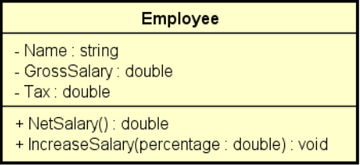

# Objetivo do programa

Fazer um programa para ler os dados de um funcionário (nome, salário bruto e imopstos)

Em seguida, mostrar os dados do funcionário (nome e salário líquido)

Em seguida, aumentar o salário do funcionário com base em uma porcentagem dada (somente o salário bruto é afetado pela
porcentagem) e mostar novamente os dados do funcionário. 

Use a classe projetada a baixo.

